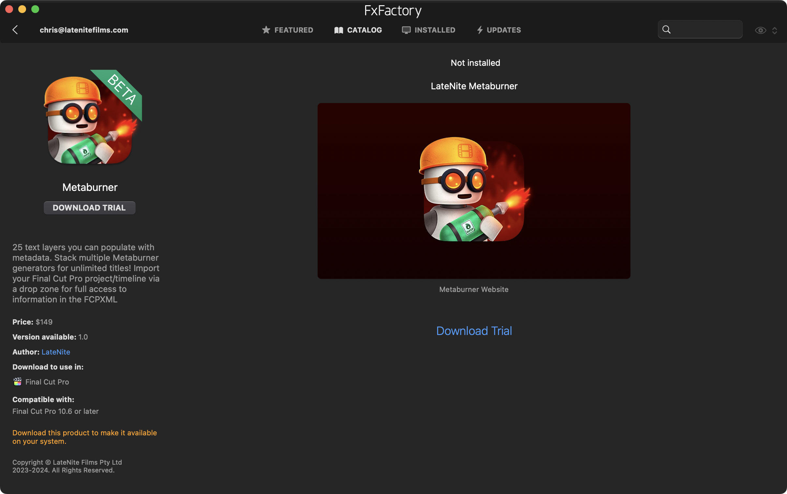

# Buy

**Metaburner** is a one-time payment of **USD$19.99** on the [Mac App Store](https://apps.apple.com/app/metaburner/id6475315396).

You can also purchase it on [FxFactory](https://fxfactory.com/info/metaburner/?action=buy).

You can download and install a watermarked version for **free** on [FxFactory](https://fxfactory.com/info/metaburner/?action=buy).

!!!success Download Now!
You can download Metaburner via [FxFactory](https://fxfactory.com/install/metaburner) or on the [Mac App Store](https://apps.apple.com/app/metaburner/id6475315396).
!!!

Got ideas or questions? Post them on our [Discussions page](https://github.com/latenitefilms/metaburner/discussions)!

---

## Unlock CommandPost

CommandPost is **The Swiss Army Knife for Post Production Professionals**.

It's an open source macOS application that makes your post production and editing life faster and lots more fun (everything is better with more buttons!). 🎛️

It's been used for projects at **Netflix**, **Pixar** and extensively at the **BBC**. People at companies such as **Apple**, **Avid** and **Adobe** use it daily.

All of the 2024 and 2025 **Apple Worldwide Developer Conference (WWDC)** videos were graded using Tangent panels in Final Cut Pro controlled by CommandPost. 🥳

After **9 years of free updates**, to ensure that CommandPost continues to be developed, improved, and stay open-source, we've decided that you need at least ONE paid LateNite application installed to use CommandPost moving forward - consider it "inner circle" software (i.e. only our mates get access to it).

You can use **Metaburner** (from Mac App Store) to "unlock" CommandPost!

