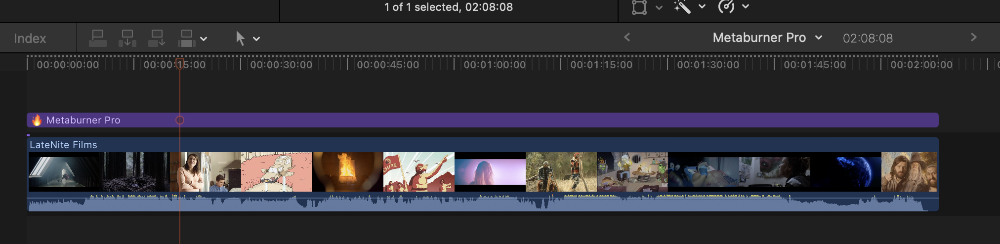
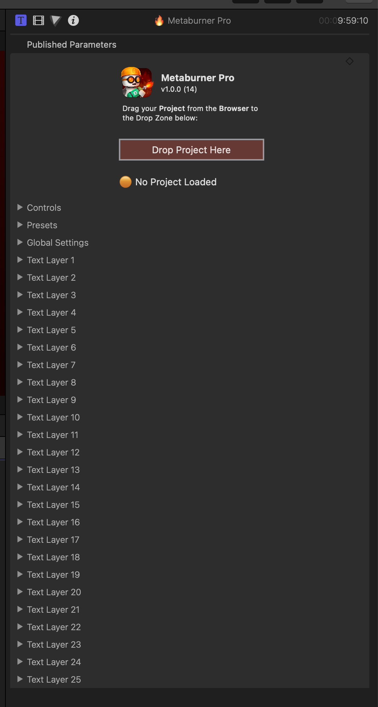

# How To Use

Metaburner Pro is currently in **early development**.

If you're interested in helping with development, you can sign up to **TestFlight** (Apple's beta-testing service) for free [here](https://testflight.apple.com/join/dw7S2veN).

Got ideas or questions? Post them on our [Discussions page](https://github.com/latenitefilms/metaburnerpro/discussions)!

Found a bug? Post about it on our [Issues page](https://github.com/latenitefilms/metaburnerpro/issues).


---

### Known Issues & Bugs

**Metaburner Pro v1.0.0 (Build 16) - 25th December 2023**

- When using the **Primary Storyline** Content Source, sometimes the first frame of a clip will display no data. This is a bug and will be fixed in a future TestFlight release.
- The **Preset** buttons currently don't do anything. This will be added in a future TestFlight release.
- The **Settings** button in the **Controls** section currently doesn't do anything. This will be added in a future TestFlight release.
- Some metadata is not "hooked up" yet, so may say "not yet implemented".

Got ideas or questions? Post them on our [Discussions page](https://github.com/latenitefilms/metaburnerpro/discussions)!

Found a bug? Post about it on our [Issues page](https://github.com/latenitefilms/metaburnerpro/issues).

You can find the full release notes [here](/release-notes/).

---

### Error Logs

You can press the **Reveal Log Files** button in the **Controls** section of the Inspector to access the `FxPlug.log` file in Finder:


The log file is located here:

```
~/Library/Containers/com.latenitefilms.MetaburnerProRenderer/Data/Library/Application Support/FxPlug.log
```

You can press the **Reveal Crash Logs** button in the **Controls** section of the Inspector to access the `DiagnosticReports` folder in Finder.


The crash logs are located here:

```
~/Library/Logs/DiagnosticReports
```

The crash logs will have file names like `Metaburner Pro Renderer-2023-12-24-103301.ips`. They might also be in the `Retired` sub-folder (these are reports that have already been posted to Apple).

Alternatively, you can access your User Library, by clicking on your **Desktop**, then holding down **OPTION** as you click the **Go** menu item in Finder. A **Library** option will appear:


You can also copy the above paths, press **COMMAND+SHIFT+G** from Finder (or via the **Go > Go to Folder...** menubar item), and paste in that path into the **Go to Folder** popup.

---

### Installing

If it's the first time installing the software, or if there's been an update to the Motion Template, you'll be prompted to **Install Motion Template**.


Once you click the button, you'll be prompted to grant permission to your **Movies** folder. This is due to macOS's sandboxing, and you'll only need to do this once. Click **OK**.


You then need to click **Grant Access**:


Once done, you'll be presented with a successful message:


The button will now be disabled, and will say **Motion Template Installed**. You can now close the Gyroflow Toolbox application.


---

### Accessing in Final Cut Pro

After installing the Motion Template, you can find the Metaburner Pro Title at the top of the Title sidebar in Final Cut Pro:


---

### Title Inspector

Simply add the Metaburner Pro Title to the top of your timeline as an adjustment layer.

It should start at the very start of your timeline.



You can then control it via the Inspector:



There are **25 customisable text layers**, which you can customise however you want.

There are **Global Settings** which apply to all Text Layers:


You can override these Global Settings on an individual text layer by deselecting the **Use Global Settings** checkbox:


The **Content Source** dropdown is where you select where you want to get your metadata from.


If you select **Custom Text** it will use the Custom Text textbox in the Inspector.

If you select **Project**, it will get the metadata from the project/timeline.

If you select **Primary Storyline**, it will get the metadata from the primary storyline, etc.

If you've selected something other than **Custom Text** you must then select a **Content Field**.


For example, if you have **Project** selected in the **Content Source**, and **Name** selected in the **Content Field**, then it will display the name of your **Project** (after you drop a Final Cut Pro Project into the drop zone).

You can add a **Prefix** and a **Suffix** to all text fields, regardless of the **Content Source** and **Content Field**.

When you first add the Metaburner Pro Title, it will display this image in your Viewer:


As the image explains, so that Metaburner Pro can access all the metadata in your project/timeline, you need to drag your project/timeline from the **Browser** to the drop zone at the top of the Inspector:


What metadata Final Cut Pro provides when dragging a project/timeline, depends on what **Metadata View** you currently have selected in the **Info Inspector**:


> Final Cut Pro can be a bit temperamental when dragging things from the Browser to the Inspector over the Viewer, so you might have to drag it slowly/carefully for it to work. Sometimes the Inspector will change views, which breaks the workflow, so simply try again.
>
> We have also noticed that sometimes Final Cut Pro can crash when exporting FCPXMLs, as documented [here](https://github.com/CommandPost/FCPCafe/issues/307). We hope that Apple will address this in a future Final Cut Pro update.

After dropping a FCPXML, the status text will change to **Analysing Project**:


After a short time, if successful, the status should change to **Project Loaded**:


> Final Cut Pro can be a bit temperamental in terms of updating the status, so you may need to click away from the Metaburner Pro Title and then go back to it for the text to update.

Once done, Metaburner Pro has access to all the metadata within the FCPXML to populate all the Content Sources.

If you make changes to the project/timeline, you'll need to drag the project back again to update the contents of Metaburner Pro.

If Metaburner Pro was unable to import the FCPXML, you'll get an error status, which you can hover over with your mouse to get more detail:


If you do run into an error, it's most likely a bug in Metaburner Pro, so please share your Error Log and FCPXML on GitHub [here](https://github.com/latenitefilms/metaburnerpro/issues).