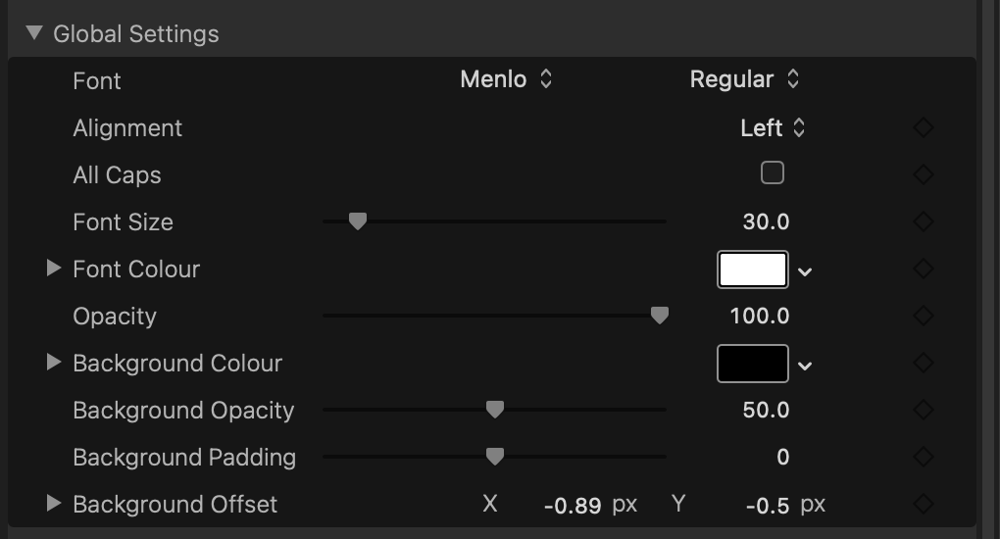

# How To Use

Metaburner Pro is currently in **early development**.

If you're interested in helping with development, you can sign up to **TestFlight** [here](https://testflight.apple.com/join/dw7S2veN).

Got ideas or questions? Post them on our [Discussions page](https://github.com/latenitefilms/metaburnerpro/discussions)!

Found a bug? Post about it on our [Issues page](https://github.com/latenitefilms/metaburnerpro/issues).

---

### Known Issues & Limitations

#### Metaburner Pro v1.0.0 (Build 3)

- There's currently no **Clip** Content Sources. These will be added in future betas.
- The **Control** buttons currently don't do anything.
- The **Preset** buttons currently don't do anything.

Got ideas or questions? Post them on our [Discussions page](https://github.com/latenitefilms/metaburnerpro/discussions)!

Found a bug? Post about it on our [Issues page](https://github.com/latenitefilms/metaburnerpro/issues).

---

### Installing

If it's the first time installing the software, or if there's been an update to the Motion Template, you'll be prompted to **Install Motion Template**.

Once you click the button, you'll be prompted to grant permission to your **Movies** folder. This is due to macOS's sandboxing, and you'll only need to do this once. Click **OK**.

You then need to click **Grant Access**:

Once done, you'll be presented with a successful message:

The button will now be disabled, and will say **Motion Template Installed**. You can now close the Gyroflow Toolbox application.

---

### Accessing in Final Cut Pro

After installing the Motion Template, you can find the Metaburner Pro Title at the top of the Title sidebar in Final Cut Pro:

---

### Title Inspector

Simply add the Metaburner Pro Title to the top of your timeline as an adjustment layer.

It should start at the very start of your timeline.

You can then control it via the Inspector:

There are 25 customisable text layers, which you can customise however you want.

There are **Global Settings** which apply to all Text Layers:

You can override these Global Settings on an individual text layer by deselecting the **Use Global Settings** checkbox:

The **Custom Field** allows you to input specific names related to the **Content Source** (for example, providing a custom metadata field).

When the **Content Source** is set to **Custom Text**, then the **Custom Text** field is used as the main text source for that text layer.

You can add a **Prefix** and a **Suffix** to all text fields.

So that Metaburner Pro can access all the metadata in your project/timeline, you need to drag your project/timeline from the **Browser** to the drop zone at the top of the Inspector:

Final Cut Pro can be a bit temperamental when dragging things from the Browser to the Inspector over the Viewer, so you might have to drag it slowly/carefully for it to work. Sometimes the Inspector will change views, which breaks the workflow, so simply try again.

Once successful, you'll get a message like this:

Once done, Metaburner Pro has access to all the metadata within the FCPXML to populate all the Content Sources.